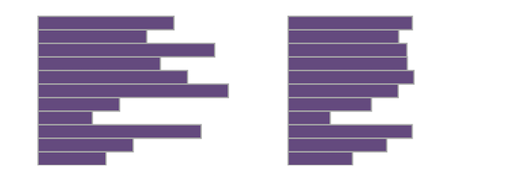
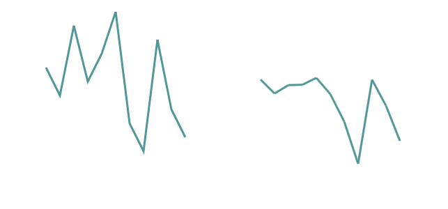
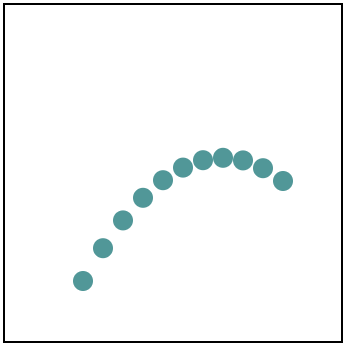

# Homework 1
*Due: Friday, March 22, 23:59.*

In this assignment you will create a simple webpage with some graphical content using HTML, CSS, and SVG. These are basic building blocks that we will manipulate in later projects using Javascript and D3 in order to create visualizations. As such, it is important that you know how the pieces work on their own, before moving forward.

## The Data

This is one of the datasets from [Anscombe's quartet](https://en.wikipedia.org/wiki/Anscombe%27s_quartet) that we discussed in Lecture. You will create multiple representations for this dataset, specifically bar charts, line charts, area charts and a scatterplot, all using vanilla SVG. *You should write the svg manually and not create it using either javascript or drawing software.*

| X    | Y    |
|:----:|:----:|
| 10.0 | 9.14 |
| 8.0  | 8.14 |
| 13.0 | 8.74 |
| 9.0  | 8.77 |
| 11.0 | 9.26 |
| 14.0 | 8.10 |
| 6.0  | 6.13 |
| 4.0  | 3.10 |
| 12.0 | 9.13 |
| 7.0  | 7.26 |
| 5.0  | 4.74 |
 

## Design and Implementation

Implement your solution in a file called ``hw1.html``, which you should store in the top-level directory of the homework 1 folder. **At the top of the file add "Intro to DataVis - Homework 1", your name, your e-mail address and your uID.** Use the proper HTML elements to structure this information and use headings to label your charts.

You can choose your design parameters freely, i.e., things like the color, aspect ratio and size of your charts is up to you. You need to make sure, however, that the data can be clearly read. Note that you will probably need to make some kind of transformation to the data to achieve pleasant results.  

You **must use selectors to style your SVG elements**, i.e., you should not use inline styling. You should also not use classes or identifiers more than necessary for each chart, i.e., one class definition per chart should be sufficient.  There are good reasons to use both css class selectors and element selectors in this homework.

Make sure your submission is a valid HTML5 file. Check that it is valid by uploading it to the [W3C HTML Validator](https://validator.w3.org/#validate_by_upload).

### Bar Charts

Create horizontal bar charts for both the X and the Y dimensions of the data. Your bars should be aligned along the left and point right. Here is what your bars might look like:

### Line Charts

Create line charts for both, the X and the Y dimensions of the data. Your y-axis should have 0 at the bottom. **Create the line chart for the X dimension out of a path element, and the line chart for the Y dimension out of SVG line elements**. Example line charts:

### Area Charts

Next, you should draw area charts of the same data. An area chart is very much like the line chart (hint: you can probably re-use some of the code from before), but it is filled. See the following examples:

### Scatterplot

A scatterplot shows how two dimensions relate to each other. Plot the X dimension along the x-axis, and the Y dimension along the y-axis. Frame your scatterplot. This should be your result, approximately:

### ASSESSMENT

25% of the grade will be given to submissions for each chart that gets full marks. The charts don’t have to look exactly like the ones shown, but the data must be clearly legible. We consider HTML validity and efficient use of the SVG elements and styles in our evaluation, i.e., even if your charts look exactly like shown here you could still loose points if you do complicated and unnecessary things.

As you will see it can be a little tedious to get the SVG to represent the data, in the next homework we will no longer write this by hand but use JavaScript to generate SVG!
